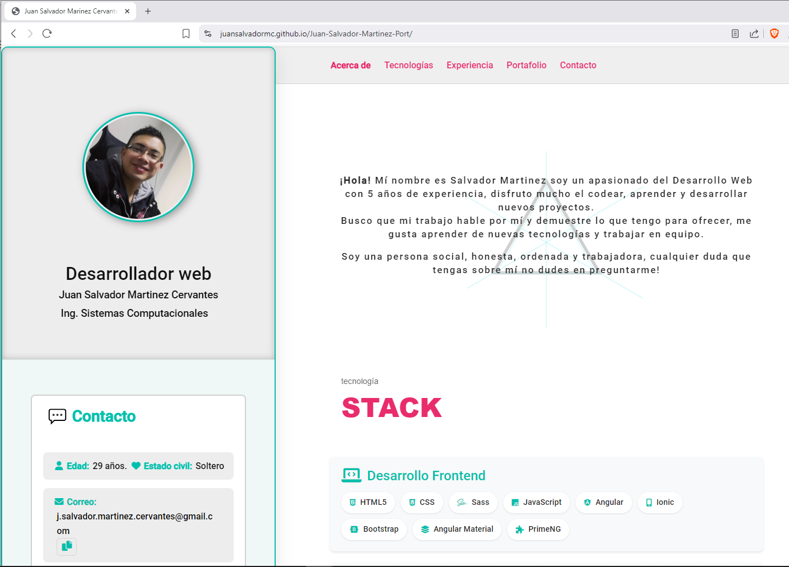
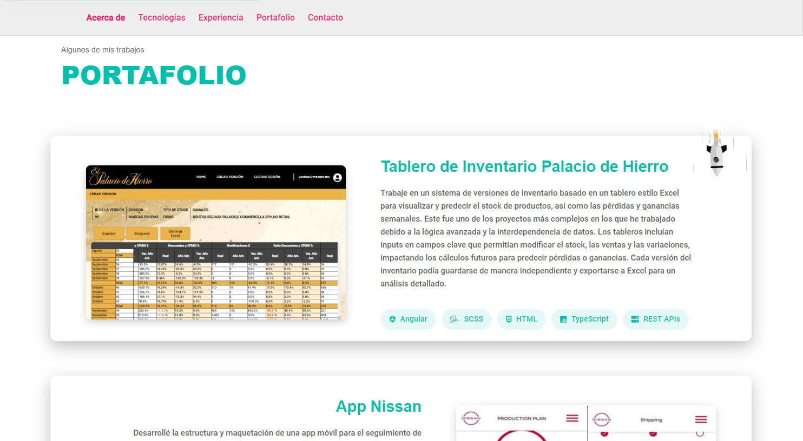
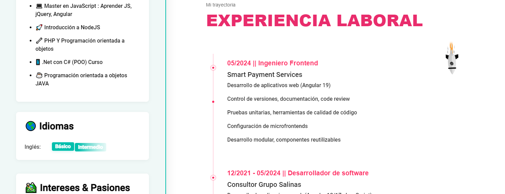
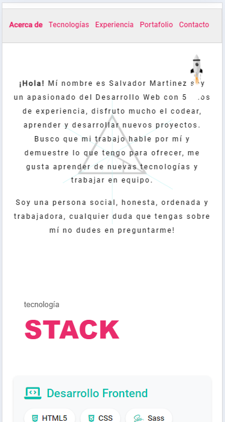
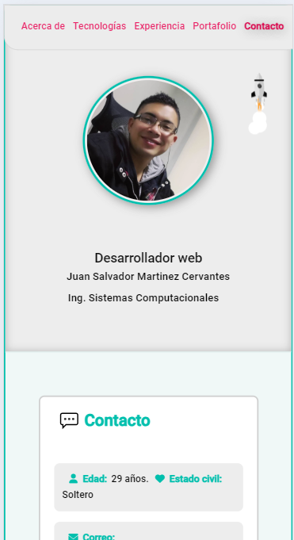

# 🚀 Juan Salvador Martínez - Web Portfolio

Welcome to my portfolio! Here you can explore a selection of projects that reflect my experience as a **Frontend Developer**.

// Bienvenido a mi portafolio! Aquí puedes explorar una selección de proyectos que reflejan mi experiencia como Desarrollador Frontend.

---

## 🔍 Hero Section Preview
// Vista previa de la sección principal

<p align="center">
  
</p>

## 🌐 Online Version

You can visit the online version of my portfolio here:
// Puedes visitar la versión en línea de mi portafolio aquí:

👉 [Juan-Salvador-Martinez-Port](https://juansalvadormc.github.io/Juan-Salvador-Martinez-Port/)

---

## 🛠️ Technologies Used

- ⚙️ HTML5, CSS3, Vanilla JavaScript  // HTML5, CSS3, JavaScript puro
- 🎨 Sass, Bootstrap                  // Sass, Bootstrap
- 🧪 Responsive Design                // Diseño responsivo
- 🖼️ Optimized Icons & Assets         // Iconos y recursos optimizados

---

## 📦 Project Structure

```bash
/
├── assets/              # Images and visual resources
├── styles/              # Global styles
├── index.html           # Entry point
├── effect.js            # Modal logic
├── t.min.js             # Carousel library
├── app.js               # Event to initialize carousel
└── ...
```

---

## 💻 Full Page Layout

<p align="center">
  
</p>

The site is built with a responsive layout that adapts seamlessly to various screen sizes, ensuring a smooth experience on both desktop and mobile devices.

// El sitio está construido con un diseño responsivo que se adapta perfectamente a varios tamaños de pantalla, asegurando una experiencia fluida tanto en escritorio como en móviles.

Built with modern CSS techniques like flexbox, media queries, and Bootstrap utilities.

// Construido con técnicas modernas de CSS como flexbox, media queries y utilidades de Bootstrap.

<p align="center">
  
</p>

## 📱 Responsive Design

<p align="center">
  
  
</p>

---

## 🚀 How to Run the Project?

// ¿Cómo ejecutar el proyecto?

You can clone the project and view it locally by following these steps:

// Puedes clonar el proyecto y visualizarlo localmente siguiendo estos pasos:

```bash
# 1. Clone the repository  // Clona el repositorio
git clone https://github.com/juanmartinezcervantes/Juan-Salvador-Martinez-Port.git

# 2. Enter the folder   // Entra en la carpeta
cd Juan-Salvador-Martinez-Port

# 3. Open the index.html file in your favorite browser  // Haz doble clic en el archivo index.html se abrira en tu navegador predeterminado
# You can double-click or use an extension like Live Server in VS Code  // Puedes hacer doble clic o usar una extensión como Live Server en VS Code
```

📝 **Note:** This is a static project and does not require any installation of dependencies.

// Nota: Este es un proyecto estático y no requiere instalación de dependencias.

---

Thank you for visiting! 🙌

